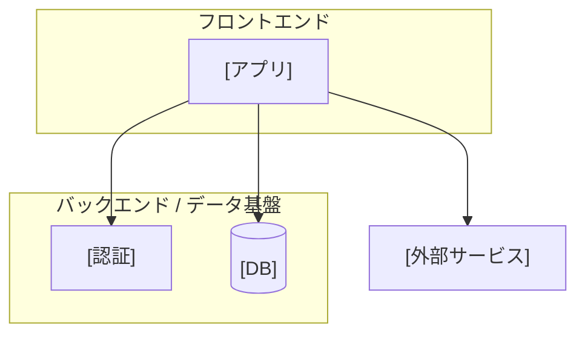
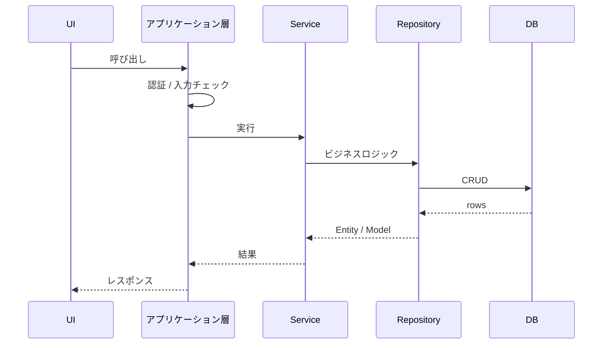

# ARCHITECTURE.md テンプレート（common）

**目的**: プロジェクト全体のシステム概要を俯瞰する正典。STDD における common ティアの技術設計で、各 feature の `TECH_DESIGN.md` の上位ティアにあたる（システム全体 = ARCHITECTURE / 機能単位 = TECH_DESIGN）。

**配置**: `docs/common/ARCHITECTURE.md`（`.stdd.config.yml` の `docs.layout.common_architecture` に従う）

## 章立ての骨格

「システム概要」に集約し、複数 feature が前提とする横断的な技術文脈を一箇所に固定する。
**データモデルは [`TABLE_DEFINITION.md`](./table-definition-common.md)、API 仕様は [`API_SPEC.md`](./api-spec-common.md) に外出し**し、本書には持たない。

| 節 | 内容 | 適用 |
| --- | --- | --- |
| 1.1 システム構成概要 | 全体構成・特徴・リポジトリ構成・レイヤ規約 | 常に |
| 1.2 使用技術スタック | フロント / バックエンド / テスト / CI・CD | 常に |
| 1.3 システム間連携 | 主要連携・連携方針・外部連携 | 常に |
| 1.4 データフロー概要 | 代表的なリクエストの流れ 1 本（シーケンス図） | 常に |
| 1.5 セキュリティ概要 | 認証・アクセス制御 / 通信 / データ保護 | 常に |
| 1.6 インフラ構成概要 | ホスティング / 可用性 / 運用・監視 | 常に |

**含めない**:

- データモデル（テーブル・カラム定義）→ [`TABLE_DEFINITION.md`](./table-definition-common.md)
- API 仕様（エンドポイント・契約）→ [`API_SPEC.md`](./api-spec-common.md)
- 機能単位のロジック設計・画面項目・テスト戦略 → 各 feature の `TECH_DESIGN.md` / `TEST_PLAN.md`
- 実装の進捗・履歴・変更経緯（SSoT として常に最新の構成のみ保持する）

**サービスの目的・アクター・業務要件**は同階層の [`REQUIREMENTS.md`](./requirements-common.md)（common）を参照する。

## 確度マーカーの運用

- 実装・ヒアリングから確信が持てない箇所は **要確認マーカー** を置く（リバース直後・前方設計時など）。必ず**仮説とセット**で `**⚠️要確認**｜仮説: … ／確認: …`（表・行内は `⚠️要確認(仮説: … / 確認: …)`）の形にし、ユーザーが是非を確定したら除去する。構文の正典は [documenting-specifications SKILL「要確認マーカー」](../SKILL.md) を参照。
- 指標やデータの確からしさを区別する場合は `[可]`（直接算出可能）/ `[近似]`（代理母集団・近似指標）等のマークを併記する。

## テンプレート構造

プレースホルダを実値に置換し、不要な節・図は削除する。単一アプリ構成では複数アプリ前提の記述を畳む。

````markdown
# [サービス名] アーキテクチャ設計書

> **位置づけ**: 本書は [サービス名] 全体のシステム概要を俯瞰する正典（common ティアの技術設計）。
> サービスの目的・アクターなどのビジネス要件は [`REQUIREMENTS.md`](./REQUIREMENTS.md) を参照。
> データモデルは [`TABLE_DEFINITION.md`](./TABLE_DEFINITION.md)、API 仕様は [`API_SPEC.md`](./API_SPEC.md) を参照。
> 機能・画面単位の技術設計は `docs/<app>/<feature>/TECH_DESIGN.md` を参照。
>
> **最終更新**: [yyyy-mm-dd] / **基準ブランチ**: [main / develop 等]

---

## 1. システム概要

### 1.1 システム構成概要

（本システムが何であるか・全体構成・特徴を端的に。1 枚の構成図を添える）

**全体構成**

- フロントエンド層: [技術・レンダリング方式・主要画面]
- バックエンド層: [新規構築 / 既存流用・責務の委譲先]
- データソース: [DB・主要テーブル群]



**特徴**

- [参照専用 / 書き込みあり 等の基本性質]
- [代理指標・近似の扱いなど、データ上の制約と方針]

**リポジトリ構成 / レイヤ規約**

```
[repo]/
├── [app]/             # (役割)
├── docs/              # 機能別 Spec + 全体ドキュメント (本書を含む)
└── .github/workflows/ # CI/CD
```

| レイヤー | 責務 | 依存方向 |
| --- | --- | --- |
| UI / アプリケーション層 | 表示・入力・ガード | 下位へのみ依存 |
| Service | ビジネスロジック | Repository の I/F に依存 |
| Repository | データアクセス | DB |

（依存は一方向。下位レイヤーは上位を知らない。アプリ間 import の禁止など固有ルールを追記）

### 1.2 使用技術スタック

**フロントエンド**

- [フレームワーク / 言語 / 主要ライブラリ]

**バックエンド / データ基盤**

- [DB / 認証 / データアクセス方式 / アクセス制御]

**テスト**

- [E2E / Integration / Unit の採用ツール]

**CI/CD・ホスティング**

- [ビルド・デプロイ自動化 / ホスティング先]

### 1.3 システム間連携

**主要連携**

1. [アプリ] ⇔ [連携先A]: [目的・方式]
2. [アプリ] ⇔ [連携先B]: [目的・方式]

**連携方針**

- [専用バックエンドを設けるか / 直接連携か 等の方針]

**外部連携**

- [外部システム連携。なければ「現時点で未定義」]

### 1.4 データフロー概要

（代表的なリクエストの流れを 1 本、シーケンス図で示す。機能個別のフローは各 feature の TECH_DESIGN に置く）



### 1.5 セキュリティ概要

- **認証・アクセス制御**: [方式・適用範囲]
- **セッション / トークン管理**: [保持・検証・失効方針]
- **通信**: [TLS 等]
- **データ保護**: [RLS・暗号化・機密情報の扱い]

### 1.6 インフラ構成概要

- **ホスティング**: [フロント / バックエンドの配置先]
- **データ・認証基盤**: [新規 / 既存流用・移行要否]
- **可用性**: [稼働率目標・メンテナンス方針]
- **CI/CD・運用・監視**: [自動化・監視・通知]
- **性能・拡張性**: [同時接続・対象ブラウザ・最適化方針]

---

## 付録・関連ドキュメント

- 共通要件定義: [`./REQUIREMENTS.md`](./REQUIREMENTS.md)
- テーブル定義: [`./TABLE_DEFINITION.md`](./TABLE_DEFINITION.md)
- API 仕様: [`./API_SPEC.md`](./API_SPEC.md)
- 機能別 Spec: `docs/<app>/<feature>/TECH_DESIGN.md`
````

## 記述しない内容（責務分界）

- サービスの目的・アクター・ビジネス要件 → common の [`REQUIREMENTS.md`](./requirements-common.md)
- テーブル・カラム定義 → common の [`TABLE_DEFINITION.md`](./table-definition-common.md)
- API 契約 → common の [`API_SPEC.md`](./api-spec-common.md)
- 機能個別のロジック設計・画面項目・テスト → 各 feature の `TECH_DESIGN.md` / `TEST_PLAN.md`
- 関数 / メソッドの具体実装コード。特定の型定義は載せない（データ構造は `TABLE_DEFINITION.md`、I/F は `API_SPEC.md`）
- 履歴・経緯・version（SSoT 原則）
