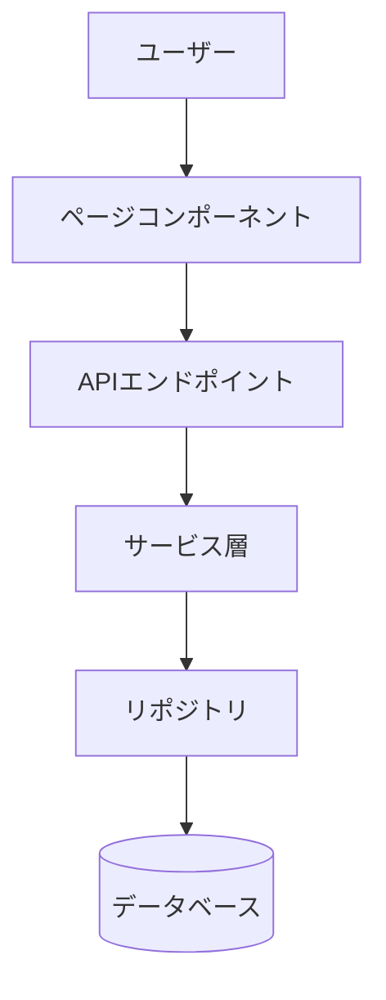
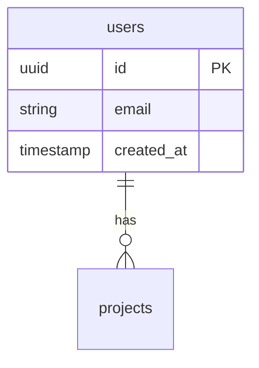

# TECH_DESIGN.md テンプレート

**目的**: 機能実装のための技術設計とテスト戦略

**配置**: `docs/<app>/<path>/TECH_DESIGN.md`

## テンプレート構造

```markdown
# [機能名] - 技術設計書

---

# Part 1: 技術設計

## 1. 機能固有アーキテクチャ

（この機能固有のアーキテクチャ図とデータフロー）



---

## 2. 主要な設計判断

### 判断1: [技術選定]

**選択**: ...
**理由**: ...

### 判断2: [アーキテクチャパターン]

**選択**: ...
**理由**: ...

---

## 3. データモデル

### ER図



### TypeScript型定義

```typescript
// Entity型
export interface UserEntity {
  id: string;
  email: string;
  created_at: string;
}

// UI型
export interface User {
  id: string;
  email: string;
  createdAt: Date;
}
```

### バリデーションルール

- `email`: 必須、メール形式、最大255文字
- `created_at`: ISO8601形式、過去の日時

---

## 4. API設計

### エンドポイント

#### POST /api/users

**リクエスト**:
```typescript
interface CreateUserRequest {
  email: string;
}
```

**レスポンス**:
```typescript
interface CreateUserResponse {
  user: User;
}
```

**ビジネスロジック**:
1. メールアドレスの重複チェック
2. ユーザー作成
3. ウェルカムメール送信

---

## 5. エラーハンドリング戦略

### エラーコード定義

| エラーコード | HTTPステータス | メッセージ | 原因 |
|------------|--------------|----------|------|
| `USER_NOT_FOUND` | 404 | ユーザーが見つかりません | 存在しないユーザーID |
| `EMAIL_ALREADY_EXISTS` | 409 | このメールアドレスは既に使用されています | メール重複 |
| `VALIDATION_ERROR` | 400 | 入力内容を確認してください | バリデーション失敗 |

### 実装方針

- すべてのエラーは`AppError`クラスを継承
- エラーコードでエラー種別を識別
- ユーザー向けメッセージとログ用メッセージを分離

---

## 6. セキュリティ要件

- **認証・認可**: 実装方法と適用範囲
- **XSS対策**: 対策内容
- **CSRF対策**: 対策内容
- **SQLインジェクション対策**: 対策内容
- **個人情報の暗号化**: 暗号化方式

---

## 7. パフォーマンス要件

- **ページ読み込み時間**: 2秒以内
- **API応答時間**: 500ms以内
- **同時接続数**: 1000ユーザー

---

## 8. テスト戦略

### ユースケース別テスト戦略

| ユースケース | E2E | Integration | Unit | 根拠 |
|---------|-----|-------------|------|-----------|
| P0: メインフロー | ✅ | ✅ | ✅ | Critical path、ビジネスに直結、複数システム統合 |
| P1: 重要なエラーケース | ⚠️ 検討 | ✅ | ✅ | 頻度高い、Integration必須、E2Eは複雑さ・コストで判断 |
| P2: エッジケース | ❌ | ⚠️ | ✅ | 低頻度、Unit十分 |

### テストファイル構成

- **E2E**: `e2e/tests/[app]/[feature].spec.ts`
- **Integration**: `[app]/components/[name].test.tsx`
- **Unit**: `[app]/lib/*.test.ts`, `[app]/domain/models/*.test.ts`
```

## 重要なポイント

- REQUIREMENTS.mdのユースケースをテストレベル（E2E/Integration/Unit）にマッピング
- テストレベル決定の根拠（Rationale）を含める
- 設計判断は「選択」と「理由」を明記
- アーキテクチャ、API設計、エラーハンドリング戦略

### 実装例・コード例について

**TECH_DESIGN.mdには実装例・コード例を含めない**。ただし、以下の場合はコードブロックの使用が許容される:

- **型定義・インターフェース**: Entity型、UI型、Request/Response型など設計情報として必要なもの
- **データモデル**: ER図、バリデーションルール
- **API設計**: エンドポイント、リクエスト/レスポンス型

以下は記述しないこと:
- 関数・メソッドの具体的な実装
- コンポーネントの実装
- Server Actions の実装
- 処理フローのコード

## TECH_DESIGN.md作成時のルール

### 1. 「実装済み」「新規追加」の分類は不要

**理由**: REQUIREMENTS.mdが常にSSoT（Single Source of Truth）であるため、TECH_DESIGN.mdでは実装済みかどうかの区別は不要。すべての要件を統一的に設計する。

❌ **悪い例**:
```markdown
### 実装済み（既存）
- ✅ 認証・認可: NextAuth + Supabase Authで二重認証

### 新規追加（パスワード認証）
- ✅ Supabase Authによるパスワード認証
```

✅ **良い例**:
```markdown
## 6. セキュリティ要件

- **認証・認可**: NextAuth + Supabase Authで二重認証
- **Supabase Authによるパスワード認証**: Credentials Providerで`signInWithPassword`を使用
```

### 2. 削除すべきセクション

TECH_DESIGN.mdでは以下のセクションは**削除する**こと:

- ❌ **Integration Points**: 外部システム・内部システムの一覧
- ❌ **実装順序**: フェーズ別の実装計画
- ❌ **ドキュメント参照文言**: 「このドキュメントは〜を参考に作成されました」

### 3. チェックボックス形式の削除

TECH_DESIGN.mdでは、実装状態を示すチェックボックス（`- [ ]`や`- ✅`）は使用しない。

❌ **悪い例**:
```markdown
## 6. セキュリティ要件

- [ ] 認証・認可の実装
- [ ] XSS対策
- ✅ CSRF対策
```

✅ **良い例**:
```markdown
## 6. セキュリティ要件

- **認証・認可**: NextAuth + Supabase Authで二重認証
- **XSS対策**: React自動エスケープ + DOMPurify
- **CSRF対策**: NextAuthがCSRFトークンを自動管理

### スコープ外

- 二要素認証（2FA）
- アカウントロック
```
