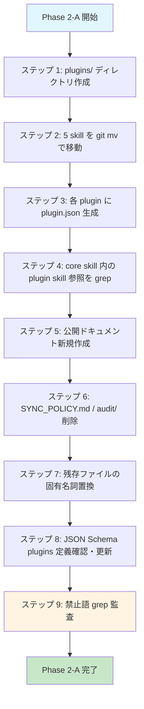

# Phase 2-A: プラグイン分離・公開ドキュメント整備・固有名詞除去 技術設計書

---

## 1. 機能固有アーキテクチャ

Phase 2-A はコード機能ではなくリポジトリ構造の再編であるため、「処理フロー」ではなく「ファイル移動・生成・削除の依存関係」と「成果物分類」を中心にアーキテクチャとして示す。



### 成果物分類

```mermaid
graph LR
    subgraph 移動(git mv)
        M1[implementing-ui]
        M2[migrating-supabase]
        M3[e2e-testing]
        M4[run-e2e]
        M5[remove-worktree]
    end
    subgraph 新規作成
        N1[plugin.json x3]
        N2[README.md]
        N3[AGENTS.md]
        N4[CONTRIBUTING.md]
        N5[CODE_OF_CONDUCT.md]
        N6[ISSUE_TEMPLATE x4]
        N7[pull_request_template.md]
    end
    subgraph 編集
        E1[core skill 内固有名詞除去]
        E2[agent 定義の固有名詞除去]
        E3[.claude/docs 固有名詞除去]
        E4[docs/ 配下の固有名詞除去]
        E5[JSON Schema plugins 定義]
    end
    subgraph 削除
        D1[SYNC_POLICY.md]
        D2[audit/PHASE0_AUDIT_REPORT.md]
        D3[audit/ ディレクトリ]
    end
```

---

## 2. 主要な設計判断

### 判断 1: プラグインメタデータのフォーマット

**選択**: `plugin.json`（JSON 形式）を採用する。

**理由**:

- core schema が既に JSON Schema（`.stdd.config.schema.json`）を採用しており、メタデータ系は JSON で統一する方が読み手の認知負荷が低い
- JSON は構文エラー検出が容易であり、`jq` / `ajv-cli` 等で機械的に検証できる
- `plugin.yml` を採用すると、`.stdd.config.yml` と紛らわしくなり、また YAML パーサ依存が増える
- 将来 npm パッケージ化する際、`package.json` と同じディレクトリに `plugin.json` を置く構造は素直に成立する

### 判断 2: skill 配置の移動手法

**選択**: `git mv` で移動する。

**理由**:

- 移動した skill の git 履歴を `git log --follow` で追跡可能にする必要がある
- skill ドキュメントは過去の改訂理由を辿れることが運用上重要
- git の rename 検出（デフォルト類似度 50%）が確実に効くよう、移動と内容変更を同一コミットに混在させず、**「移動」と「内容書き換え」のコミットを分割**する

### 判断 3: GitHub URL（`careerchain-ys/stdd`）の扱い

**選択**: `packages/core/README.md` および `packages/core/schema/.stdd.config.schema.json` の `$id` に登場する `https://raw.githubusercontent.com/careerchain-ys/stdd/main/...` という URL は**そのまま維持する**。ただし「これはリポジトリのホスト組織名であり、stdd の利用に旧プロジェクトへの依存はない」旨を README 内に注記する。

**理由**:

- これらは「公開リポジトリの所在地を示す URL」であって、stdd の機能・スキーマに固有プロジェクトの概念が含まれているわけではない
- URL を変更すると JSON Schema の `$id` が変わり、公開リポジトリ運用上、`.stdd.config.yml` で `yaml-language-server: $schema=...` を設定している下流プロジェクトでスキーマ参照が壊れる
- GitHub の org rename / repo rename を将来行う場合は別 Phase で扱う方が安全
- 注記により、外部開発者が URL を見て「組織名固有の何か」と誤解する余地を消す

### 判断 4: 公開ドキュメントの言語

**選択**: 日本語のみで記述する。

**理由**:

- `SYNC_POLICY.md` および Phase 0 監査時点の決定として「日本語のみ。英訳は実施しない」が確定済み
- v0.1.0 リリース時点での主たる利用想定者は日本語圏のため、日本語版で完成度を上げることを優先

### 判断 5: `SYNC_POLICY.md` の削除

**選択**: 削除する。

**理由**:

- 同ドキュメントは「stdd OSS と社内プロジェクトの分離ポリシー」を述べたものだが、Phase 2-A 完了時点で旧プロジェクト名が公開リポジトリから消える
- 公開リポジトリの読み手にとって「社内プロジェクトとの関係性」は無関係な情報であり、混乱を招く
- 監査記録としては git 履歴に残るため、文書として残置する必要はない

### 判断 6: PR テンプレートの「評価結果」項目

**選択**: PR テンプレートに評価結果（eval-result）添付セクションを含めるが、Phase 2-A 時点では**必須ではなく強く推奨**の位置付けとする。

**理由**:

- 評価結果の閾値（auto-implement quick success rate ≥80% 等）は Phase 2-C で QA gate として確定する
- Phase 2-A 時点でブロッキング条件にすると、ドキュメント整備のみの PR まで阻害される
- テンプレート構造としてセクションを用意しておけば、Phase 2-C で「必須化」への切り替えが容易

---

## 3. データモデル

Phase 2-A は機能実装ではないため、ランタイムのデータモデルは持たない。代わりに**ファイル成果物のスキーマ**を定義する。

### `plugin.json` スキーマ

```typescript
interface PluginManifest {
  /** プラグインの一意 ID。`@stdd/plugin-<id>` 形式の npm パッケージ名に対応する。kebab-case 推奨 */
  id: string;
  /** ヒューマンリーダブルな表示名 */
  name: string;
  /** SemVer 形式のバージョン。Phase 2-A 時点では全プラグイン "0.1.0" */
  version: string;
  /** このプラグインが提供する skill ID の配列。`skills/<skill-id>/SKILL.md` が存在する前提 */
  skills: string[];
  /** プラグインの簡単な説明（任意） */
  description?: string;
}
```

### 各 `plugin.json` の具体的内容

| プラグイン        | id                | name                                   | skills                                    |
| ----------------- | ----------------- | -------------------------------------- | ----------------------------------------- |
| nextjs-supabase   | `nextjs-supabase` | Next.js + Supabase スタック向けプラグイン | `implementing-ui`, `migrating-supabase`   |
| playwright        | `playwright`      | Playwright E2E テスト向けプラグイン        | `e2e-testing`, `run-e2e`                  |
| worktree          | `worktree`        | git worktree + devcontainer 向けプラグイン | `remove-worktree`                         |

**注記**: `run-e2e` は実行手順上 worktree にも依存するが、プラグインの主要分類は「Playwright 実行系」のため `playwright` プラグイン側に配置する。`@stdd/plugin-playwright` が `@stdd/plugin-worktree` を peer dependency として持つ構造は将来別 Phase で正式化する。

### バリデーションルール

- `id`: 必須、`^[a-z][a-z0-9-]*$` パターン、最小 1 文字
- `name`: 必須、最小 1 文字
- `version`: 必須、SemVer 2.0.0 形式
- `skills`: 必須、最小 1 要素、各要素は kebab-case の文字列
- `description`: 任意

### `.stdd.config.yml` の `plugins` フィールド（スキーマからの抜粋・確認）

```typescript
type PluginsField = PluginEntry[];
type PluginEntry =
  | string  // 形式 A: 短縮 ID
  | { id: string; options?: Record<string, unknown> };  // 形式 B: オプション付き
```

`packages/core/schema/.stdd.config.schema.json` は `plugins` フィールドで形式 A（文字列）と形式 B（`{ id, options }` オブジェクト）の両方を受け入れる。具体的な扱い（編集対象としての位置付け）は §9 にまとめる。

### AGENTS.md 生成ガイダンス

AGENTS.md は agents.md 標準（[agents.md](https://agents.md/)）に準拠し、最低限以下のセクションを日本語で含める。各セクションは見出しレベル 2 (`##`) で記述する。

| セクション                              | 内容                                                                                       |
| --------------------------------------- | ------------------------------------------------------------------------------------------ |
| プロジェクト概要                        | stdd の目的・スコープ・想定読者（AI エージェントが最初に読むコンテキスト）                 |
| セットアップ手順 (Setup commands)       | リポジトリのクローン後にエージェントが実行すべき初期化コマンド一覧                         |
| ビルド・テスト・lint コマンド           | `.stdd.config.yml` の `commands.typecheck` / `commands.test` 等にマッピングされる主要コマンド |
| コードスタイル (Code style)             | 言語別の整形規約・採用 lint ルール・命名規約                                               |
| テスト方針 (Testing)                    | STDD における Spec → Test → Impl の順序、Unit / Integration / E2E の責務分離              |
| セキュリティ留意事項 (Security)         | シークレットの取扱い、公開リポジトリで扱わない情報、CODE_OF_CONDUCT との関係              |
| PR ガイドライン (Pull request)          | コミット粒度、DCO sign-off、PR テンプレートの評価結果欄に関する案内                        |

agents.md 標準が将来追加セクションを定義した場合は、本セクション一覧を更新して追従する。

---

## 4. API 設計

Phase 2-A はランタイム API を持たないため、代わりに**コマンドラインインタフェース（メンテナが実行する手順コマンド）**を API として定義する。

### コマンド 1: プラグインディレクトリ作成

```bash
mkdir -p plugins/nextjs-supabase/skills
mkdir -p plugins/playwright/skills
mkdir -p plugins/worktree/skills
```

### コマンド 2: skill 移動

```bash
git mv .claude/skills/implementing-ui    plugins/nextjs-supabase/skills/implementing-ui
git mv .claude/skills/migrating-supabase plugins/nextjs-supabase/skills/migrating-supabase
git mv .claude/skills/e2e-testing        plugins/playwright/skills/e2e-testing
git mv .claude/skills/run-e2e            plugins/playwright/skills/run-e2e
git mv .claude/skills/remove-worktree    plugins/worktree/skills/remove-worktree
```

### コマンド 3: 履歴追跡確認

```bash
git log --follow --oneline plugins/nextjs-supabase/skills/implementing-ui/SKILL.md
git log --follow --oneline plugins/playwright/skills/e2e-testing/SKILL.md
git log --follow --oneline plugins/worktree/skills/remove-worktree/SKILL.md
```

各コマンドで「移動前」のコミット履歴が連続して表示されること。

### コマンド 4: 禁止語 grep 監査

```bash
grep -rIn -E '(careerchain|CareerChain|キャリアチェーン)' . \
  --exclude-dir=.git \
  --exclude-dir=node_modules \
  --exclude=LICENSE \
  --exclude=NOTICE
```

期待結果: ヒット件数 0。ただし以下は許容例外として目視確認する。

- `packages/core/README.md` の `raw.githubusercontent.com/careerchain-ys/stdd/...` URL
- `packages/core/schema/.stdd.config.schema.json` の `$id` フィールドの同 URL

これら 2 件のみが残ることを許容とし、それ以外がヒットした場合は Phase 2-A 未完了と判定する。

### コマンド 5: JSON Schema 構文検証

```bash
npx -y ajv-cli compile -s packages/core/schema/.stdd.config.schema.json
```

エラー 0 で完了すること。

### コマンド 6: plugins フィールドのサンプル検証

`/tmp/sample-plugins.json` に下記を保存:

```json
{
  "project": { "name": "test", "primary_branch": "main" },
  "apps": [{ "id": "web", "path": "apps/web" }],
  "commands": { "typecheck": "tsc", "test": "vitest" },
  "docs": {
    "layout": {
      "requirements": "docs/{{app.id}}/{{feature_path}}/REQUIREMENTS.md",
      "tech_design": "docs/{{app.id}}/{{feature_path}}/TECH_DESIGN.md",
      "plan": "docs/{{app.id}}/{{feature_path}}/plans/{{date}}.md"
    }
  },
  "plugins": [
    "nextjs-supabase",
    { "id": "playwright", "options": { "base_url": "http://localhost:3000" } },
    { "id": "worktree" }
  ]
}
```

検証コマンド:

```bash
npx -y ajv-cli validate -s packages/core/schema/.stdd.config.schema.json -d /tmp/sample-plugins.json
```

期待結果: `valid` を出力すること。

### コマンド 7: plugin.json 構文検証

```bash
for f in plugins/*/plugin.json; do
  echo "--- $f ---"
  python3 -m json.tool "$f" > /dev/null && echo OK
done
```

3 ファイルすべてで `OK` が出力されること。

---

## 5. エラーハンドリング戦略

Phase 2-A は人間のメンテナが実行する一連の手順であり、ランタイムエラーは存在しない。代わりに「**起こり得る失敗とその検出・回復方法**」を定義する。

### 失敗モード一覧

| 失敗モード                                | 検出方法                                                | 回復方法                                                                |
| ----------------------------------------- | ------------------------------------------------------- | ----------------------------------------------------------------------- |
| `git mv` 後の履歴追跡不能                 | `git log --follow` の出力が移動前で途切れる             | コミットを reset して、内容書き換えを別コミットに分離して再実施         |
| `plugin.json` の JSON 構文エラー          | `python3 -m json.tool` または `jq .` がエラーを返す     | 該当ファイルの構文修正                                                  |
| 禁止語の残存                              | grep 監査でヒット                                       | 該当箇所を汎用表現に置換                                                |
| skill 内の相対パス参照切れ                | core skill 内の `.claude/skills/{moved-skill}/` 文字列  | 「該当プラグインの skill を参照」等の汎用表現に書き換え                 |
| JSON Schema の plugins 定義不備           | `ajv-cli validate` で形式 B のサンプルが reject される  | schema の `plugins.items.oneOf` を修正                                  |
| `audit/` ディレクトリ削除忘れ             | ディレクトリリストに `audit/` が残る                    | `rmdir audit/`（空であることを確認の上）                                |
| Contributor Covenant 翻訳の出典欠落       | CODE_OF_CONDUCT.md レビュー時に出典 URL なし            | ファイル末尾に出典 URL を追記                                           |
| PR テンプレートが GitHub UI で認識されない | テスト PR を作成して確認                                | パスが `.github/pull_request_template.md` 直下であることを確認         |

### エラー判定基準（Phase 2-A 完了判定）

以下のいずれかが false の場合、Phase 2-A は未完了と判定する:

- 上記「コマンド 3 / 4 / 5 / 6 / 7」が期待結果通りに完了する
- リポジトリルートに README.md / AGENTS.md / CONTRIBUTING.md / CODE_OF_CONDUCT.md が存在する
- `.github/ISSUE_TEMPLATE/` に 4 ファイル、`.github/pull_request_template.md` が存在する
- `SYNC_POLICY.md` および `audit/` ディレクトリが存在しない

---

## 6. セキュリティ要件

- **公開前のシークレット監査**: Phase 2-A 完了後、`gitleaks detect` 相当のスキャンを別途実施する（Phase 2-C の QA gate で正式実施）。Phase 2-A の範囲ではメンテナが目視で API キー・トークン・テストユーザー情報が含まれていないことを確認する
- **個人情報除去**: `SYNC_POLICY.md` 削除および固有名詞除去により、社内プロジェクト固有の人名・メールアドレス・内部ホスト名がリポジトリから消えていることを確認する
- **ライセンス整合性**: LICENSE / NOTICE 内の著作権表記は維持する（旧組織名を含む正規の著作権表記であり、削除すると Apache-2.0 の要件を満たさなくなる）
- **DCO （Developer Certificate of Origin）**: CONTRIBUTING.md にて DCO への言及を含め、外部貢献者が `Signed-off-by:` をコミットに付与する運用を案内する

---

## 7. パフォーマンス要件

Phase 2-A はランタイム機能を持たないため、パフォーマンス指標は持たない。代わりに**ドキュメント可読性指標**を定義する。

- **README.md の長さ**: 250 行以下に収める（外部開発者が初回訪問時にスクロールせず概要を掴める範囲）
- **issue / PR テンプレート**: 各ファイル 80 行以下（記入時の認知負荷低減）
- **JSON Schema 検証時間**: スキーマで定義済み（`ajv-cli compile` が 5 秒以内に完了）

---

## 8. テスト戦略

Phase 2-A はランタイムコードを生成しないため、従来の Unit / Integration / E2E 3 層構造ではなく、**監査スクリプト（grep / json validation / schema validation）と目視レビュー**でテストを構成する。

### ジャーニー別テスト戦略

| ジャーニー                                                | 監査スクリプト | スキーマ検証 | 目視レビュー | 根拠                                                                                                  |
| --------------------------------------------------------- | -------------- | ------------ | ------------ | ----------------------------------------------------------------------------------------------------- |
| P0: プラグイン対象 skill を物理的に分離する               | ✓              | ✓            | ✓            | ディレクトリ存在確認 / git 履歴追跡 / `plugin.json` 構文検証 / 目視で配置が docs/policy §3 と一致     |
| P0: 公開リポジトリの入口ドキュメントを整備する            | ✓              | -            | ✓            | ファイル存在確認スクリプト / 内容は人間レビューで品質判定                                             |
| P0: 旧プロジェクト名を最終除去する                        | ✓              | -            | ✓            | 禁止語 grep で機械的に検出 / 残存箇所が許容例外（LICENSE/NOTICE/公開 URL）のみであることを目視確認 |
| P0: プラグイン宣言形式の妥当性を JSON Schema で保証する   | ✓              | ✓            | -            | サンプル YAML を ajv-cli で検証                                                                       |
| P1: 公開後に外部開発者が初めてリポジトリを訪れる          | -              | -            | ✓            | 第三者レビュー（理想的には stdd 外の開発者）による可読性判定                                          |
| P1: プラグイン skill 移動が core skill の参照を破壊しない | ✓              | -            | ✓            | core skill 内の旧パス文字列を grep / 残存箇所を目視で置換確認                                         |
| P2: 外部開発者が `careerchain-ys/stdd` URL に戸惑う       | -              | -            | ✓            | README 内の注記が明示的に存在することを目視確認                                                       |

### 監査スクリプト一覧（合計 7 種類）

| #   | スクリプト                                        | 対応ジャーニー                                                              | 合格基準                                            |
| --- | ------------------------------------------------- | --------------------------------------------------------------------------- | --------------------------------------------------- |
| 1   | プラグインディレクトリ存在確認                    | P0: プラグイン分離                                                          | 3 ディレクトリすべて存在                            |
| 2   | `git log --follow` による履歴追跡                 | P0: プラグイン分離                                                          | 5 skill すべてで移動前コミットが表示される          |
| 3   | `plugin.json` JSON 構文検証                       | P0: プラグイン分離                                                          | 3 ファイルすべて valid                              |
| 4   | 禁止語 grep                                       | P0: 固有名詞除去 / P1: 参照破壊なし                                          | 許容例外以外でヒット 0                              |
| 5   | `ajv-cli compile` によるスキーマ自己検証          | P0: JSON Schema 保証                                                        | エラー 0                                            |
| 6   | `ajv-cli validate` による plugins 形式サンプル検証 | P0: JSON Schema 保証                                                        | 形式 A / 形式 B 両方が valid                        |
| 7   | 公開ドキュメント存在確認                          | P0: 公開ドキュメント整備                                                    | ルート 4 ファイル + `.github/` 5 ファイルすべて存在 |

### 目視レビュー観点

- README.md 冒頭 3 段落で「STDD は何か」が伝わるか
- AGENTS.md が agents.md 標準準拠の構造を持っているか（最低限、AI エージェント別の設定セクションを含む）
- CODE_OF_CONDUCT.md に Contributor Covenant 2.1 の出典 URL が記載されているか
- PR テンプレートに評価結果セクションが存在するか
- `packages/core/README.md` 内に「URL 上の組織名は公開リポジトリの所在地であり、stdd の中立性に影響しない」旨の注記が存在するか
- core skill 内に「`.claude/skills/implementing-ui` を参照」等の壊れたパス参照が残っていないか

### テスト総数と内訳

- **監査スクリプト**: 7 種類
- **目視レビュー観点**: 6 項目
- **合計**: 13 項目

すべての項目に合格した時点で Phase 2-A 完了とする。

### テストファイル構成

Phase 2-A はランタイムテストを持たないため、テストファイルは生成しない。代わりに監査スクリプトを以下のいずれかの形式で管理する:

- **オプション A（推奨）**: PR description 内に検証コマンドを列挙し、CI ではなく PR レビュー時に手動実行
- **オプション B**: `scripts/audit/phase2a-checks.sh` 等にまとめて将来 CI 化（スコープ外、Phase 2-C 以降で検討）

Phase 2-A ではオプション A を採用する。

---

## 9. 付録: 対象ファイル詳細一覧

### 移動対象（5 件、`git mv` で実施）

| 移動元                                | 移動先                                              |
| ------------------------------------- | --------------------------------------------------- |
| `.claude/skills/implementing-ui/`     | `plugins/nextjs-supabase/skills/implementing-ui/`   |
| `.claude/skills/migrating-supabase/`  | `plugins/nextjs-supabase/skills/migrating-supabase/`|
| `.claude/skills/e2e-testing/`         | `plugins/playwright/skills/e2e-testing/`            |
| `.claude/skills/run-e2e/`             | `plugins/playwright/skills/run-e2e/`                |
| `.claude/skills/remove-worktree/`     | `plugins/worktree/skills/remove-worktree/`          |

### 新規作成対象（合計 12 件）

| パス                                                | 種別                       |
| --------------------------------------------------- | -------------------------- |
| `plugins/nextjs-supabase/plugin.json`               | プラグインメタデータ       |
| `plugins/playwright/plugin.json`                    | プラグインメタデータ       |
| `plugins/worktree/plugin.json`                      | プラグインメタデータ       |
| `README.md`                                         | リポジトリトップドキュメント |
| `AGENTS.md`                                         | agents.md 標準準拠         |
| `CONTRIBUTING.md`                                   | 貢献ガイド                 |
| `CODE_OF_CONDUCT.md`                                | Contributor Covenant 2.1   |
| `.github/ISSUE_TEMPLATE/skill-request.md`           | issue テンプレ             |
| `.github/ISSUE_TEMPLATE/bug-report.md`              | issue テンプレ             |
| `.github/ISSUE_TEMPLATE/plugin-proposal.md`         | issue テンプレ             |
| `.github/ISSUE_TEMPLATE/agent-support-request.md`   | issue テンプレ             |
| `.github/pull_request_template.md`                  | PR テンプレ                |

### 編集対象（固有名詞除去）

| パス                                          | 編集内容                                                                     |
| --------------------------------------------- | ---------------------------------------------------------------------------- |
| `.claude/agents/spec-writer.md`               | `CareerChain（キャリアチェーン）プラットフォーム` → `対象プロジェクト`        |
| `.claude/agents/plan-writer.md`               | 同上                                                                         |
| `.claude/agents/implementer.md`               | 同上                                                                         |
| `.claude/agents/code-reviewer.md`             | 同上                                                                         |
| `.claude/agents/qa-engineer.md`               | `/home/user/careerchain/...` → 汎用パスまたは `{{apps[].path}}` 参照に書換え |
| `.claude/skills/software-architecture/SKILL.md` | `CareerChainプロジェクトの` → `対象プロジェクトの`                            |
| `.claude/skills/auto-implement/SKILL.md`      | `careerchain-worktree-<instance-id>` → `worktree-<instance-id>`              |
| `.claude/docs/spec-driven-development-guide.md` | grep ヒット 0 のため対象外（Phase 1-A で除去済み状態を維持）                  |
| `docs/plugin-separation-policy.md`            | §3.1 内の `CareerChain 固有の admin 権限モデル` 等の例示を一般化              |
| `docs/phase1/plans/2026-05-17-core.md`        | 社内 issue 番号 URL を削除、`CareerChain 本体` を `下流プロジェクト` 等に置換 |

### スキーマ・公開 URL を含むファイル（編集 + 部分維持）

下記 2 ファイルは「編集対象」と「維持対象」が同一ファイル内に混在するため、扱いを 1 行ずつ明示する。

| パス                                            | 扱い                                                                                                                                  | 理由                                                                                                       |
| ----------------------------------------------- | ------------------------------------------------------------------------------------------------------------------------------------- | ---------------------------------------------------------------------------------------------------------- |
| `packages/core/schema/.stdd.config.schema.json` | 編集（`plugins` フィールド定義の確認・必要なら追補）／ただし `$id` の URL（`careerchain-ys/stdd` を含む）は維持                       | `$id` は GitHub repo の物理位置を指す identifier であり、組織名固有の概念への参照ではない                  |
| `packages/core/README.md`                       | 編集（判断 3 に基づき「URL 上の組織名は公開リポジトリの所在地であり、stdd の中立性に影響しない」旨の注記を追加）／`yaml-language-server` の URL 自体は維持 | URL 変更は下流プロジェクトの `yaml-language-server: $schema=...` 参照を破壊するため、文字列としては変更しない |

### 削除対象

| パス                          | 理由                                                       |
| ----------------------------- | ---------------------------------------------------------- |
| `SYNC_POLICY.md`              | 単体 OSS リポジトリとして独立するため社内同期方針は不要      |
| `audit/PHASE0_AUDIT_REPORT.md` | 監査記録は git 履歴に残るため、文書として残す必要なし       |
| `audit/`                      | 上記削除後に空になったら `rmdir` でディレクトリごと削除     |

### 維持対象（変更しない）

| パス                        | 理由                                                              |
| --------------------------- | ----------------------------------------------------------------- |
| `LICENSE`                   | Apache-2.0 著作権表記の正規記載。旧組織名を含んでいても削除しない |
| `NOTICE`                    | 同上                                                              |
| `packages/core/templates/*` | Phase 1-A で固有名詞除去済みの状態を維持                          |
| `packages/core/docs/*`      | Phase 1-A で固有名詞除去済みの状態を維持                          |
