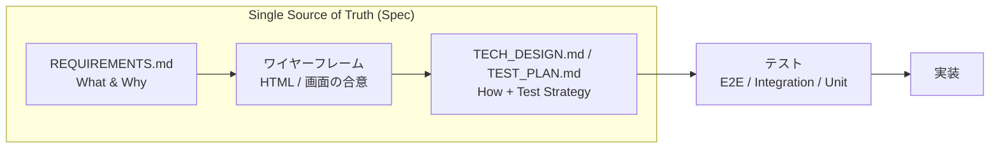
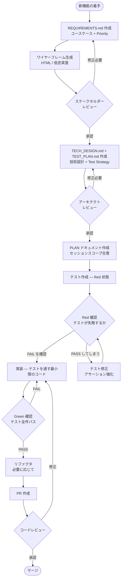
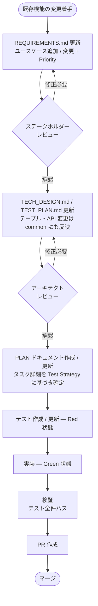
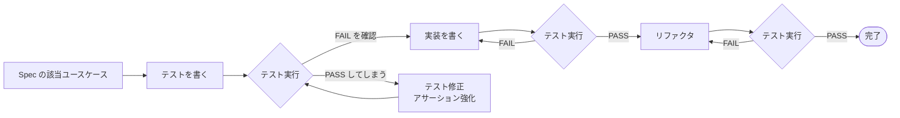
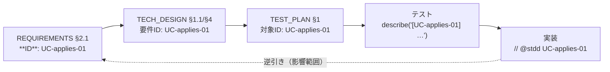

# STDD (Spec and Test Driven Development) — 方法論ガイド

## 1. STDD とは

### 1.1 定義

仕様 (Spec) を先に定義し、その仕様に基づいてテストを作成し、テストを通すために実装する開発手法。

### 1.2 特徴ともたらされるメリット

STDD は次の 2 つを特徴とする。

- Spec が SSoT (Single Source of Truth) となり、常に最新の状態に維持される
- 開発を Spec → テスト → 実装 の一方向で進め、Spec / テスト / 実装 の一貫性を保つ

これらは次のメリットをもたらす。

- 「ドキュメントの陳腐化」が起こらず、AI エージェントやステークホルダーは Spec だけ読めば常に最新仕様を把握できる
- Specレビュー段階で開発の方向性を確定でき、手戻りを最小化できる
- コードレビューコストが大幅に低下する
- Spec と実装の乖離が構造的に発生せず、デグレを気にせず内部実装をいかようにもリファクタリングできる

### 1.3 AI エージェントとの協働

STDD は AI エージェント (Claude Code / OpenAI Codex 等) との協働を前提に設計されている。役割分担は次のとおり。

- 人間は「何を作るか (What)」を Spec に固定する
- AI は「どう作るか (How)」をテストと実装で実現する

仕様が正確でありさえすれば、AI はそれを唯一の入力として、Test Strategy に沿ったテスト作成から実装まで行える。人間は仕様の正確さに集中すればよい。

### 1.4 各成果物の役割

3 つの成果物は、それぞれ次の役割を担い、相互に整合し続ける。

- Spec: ビジネス要件 / 技術仕様の SSoT。常に最新の「What / Why」を保持する
- テスト: 仕様の実行可能な証明。Spec の要求を機械的に検証できる形に落とす
- 実装: テストを通すための手段。テストが緑になることで仕様の充足を証明する

---

## 2. CORE: 常に Spec を起点とした一方向のウォーターフォール

STDD の中核は、Spec → テスト → 実装 という一方向の流れを崩さないことにある。矢印は決して遡行しない。

これにより、

- Spec と実装の乖離が構造的に発生しなくなる
- AI エージェントやステークホルダーは Spec だけ読めば最新仕様を把握できる

---

## 3. Spec ドキュメントの構成

Spec は、用途による 2 種別（要件 spec / 技術 spec (tech_specs)）と、適用範囲による 2 階層（common / feature）で整理される。階層は 3.1、種別は 3.2〜3.3 で述べる。

### 3.1 Spec の 2 階層構造 (common / feature)

Spec は、プロジェクト全体を見る common 階層と、機能単位を見る feature 階層の 2 つに分かれる。テーブル定義や API 仕様のような横断的な要素は common に集約し、feature 側はそれを参照する。

| 階層    | ドキュメント                                                                                                                                            | 配置例                  |
| ------- | ------------------------------------------------------------------------------------------------------------------------------------------------------- | ----------------------- |
| common  | `REQUIREMENTS.md`（業務要件）/ `ARCHITECTURE.md`（システム概要）/ `TABLE_DEFINITION.md`（テーブル定義）/ `API_SPEC.md`（API 仕様）/ `DESIGN.md`（任意） | `docs/common/`          |
| feature | `REQUIREMENTS.md` / `TECH_DESIGN.md` / `TEST_PLAN.md`                                                                                                   | `docs/<app>/<feature>/` |

common 階層の役割は次のとおり。

- サービスの目的・アクター・アプリ構成 (REQUIREMENTS) を記述する
- システム概要として構成・スタック・連携・セキュリティ・インフラ (ARCHITECTURE) を記述する
- 複数の feature が前提とする横断的な文脈を一箇所に集約する SSoT として機能する

feature 階層の役割は次のとおり。

- 個々の機能の要件 (REQUIREMENTS)・技術設計 (TECH_DESIGN)・テスト戦略 (TEST_PLAN) を記述する

命名と配置の補足。

- 配置は `.stdd.config.yml` の `docs.layout.common_*` で設定する（任意。common 階層を使わないプロジェクトでは省略可）
- テンプレートは `.claude/skills/documenting-requirements/templates/`（`requirements-common.md`）と `.claude/skills/documenting-tech-specs/templates/`（`architecture-common.md` / `table-definition-common.md` / `api-spec-common.md` / `design-common.md`）を参照する

### 3.2 要件 spec (REQUIREMENTS.md)

「何を・なぜ作るか」をユーザー視点で記述する。解決する問題・対象ユーザー・ビジネス目標、Priority (P0 / P1 / P2) 付きのユースケース、UI / UX、成功基準など。

読者: ステークホルダー、PM、デザイナー、エンジニア

### 3.3 技術 spec (tech_specs)

「どう作るか」を技術視点で記述する設計書の総称。次のファイルで構成される。

- `ARCHITECTURE.md` — システム全体の構成・スタック・連携（common）
- `TECH_DESIGN.md` — 機能単位の技術設計：概要・設計判断・画面項目定義・ロジック設計・エラーハンドリング（feature）
- `TABLE_DEFINITION.md` — 全テーブル定義（common）
- `API_SPEC.md` — API 契約（common）
- `TEST_PLAN.md` — テスト戦略：どのユースケースをどのテストレベルで担保するか（feature）
- `DESIGN.md` — デザイン標準（common・任意）

読者: エンジニア、AI エージェント、アーキテクト

---

## 4. テスト戦略

STDD においては、テストは仕様の実行可能な証明であり、どのユースケースをどのテストレベルで担保するかを実装時ではなく Spec の段階で決める。REQUIREMENTS.md のユースケースに付けた Priority (P0 / P1 / P2) がテスト構成を決定し、その対応づけを TEST_PLAN.md に記録する。

### 4.1 テストレベル

| レベル      | 対象                                        | 目的                                   |
| ----------- | ------------------------------------------- | -------------------------------------- |
| E2E         | 機能 (feature) またはページ (page) 単位     | Critical Paths のみ                    |
| Integration | ページ以下のコンポーネント / モジュール統合 | エラーケース、コンポーネント間結合     |
| Unit        | 関数 / メソッド単体                         | 詳細ロジック、バリデーション、純粋関数 |

### 4.2 Priority と推奨テスト構成

| Priority | 定義                                                                                                 | 推奨テスト構成                                     |
| -------- | ---------------------------------------------------------------------------------------------------- | -------------------------------------------------- |
| P0       | Critical Path ビジネス直結、頻度が非常に高い、複数システム統合、データ損失 / セキュリティに関わる | E2E 必須 + Integration + Unit                      |
| P1       | Important 重要だが Critical ではない、頻度が高い、エラーケースの大半                              | E2E 検討（複雑さ・コストで判断）+ Integration 必須 |
| P2       | Nice to Have エッジケース、頻度が低い、UX 改善                                                    | E2E 不要 + Integration 検討 + Unit                 |

### 4.3 「E2E は P0 のみ」の原則

- E2E は実行コストもメンテナンスコストも高い
- すべてのユースケースを E2E で網羅すると、テストが壊れやすくなり、CI が長時間化する
- P0 のフローのみ E2E で守り、それ以外は Integration / Unit に役割を譲る

### 4.4 エラーケースもユースケースとして記述する

- エラーは「その他」ではなく、正規のユースケースとして REQUIREMENTS.md に書く
- こうすることで、エラー時の挙動（メッセージ・回復導線）が暗黙仕様にならず、テストにマッピングできる

---

## 5. 開発フロー

### 5.1 新機能開発

ワイヤーフレーム生成は UI を持つ機能のみ。テスト作成は Unit → Integration → E2E の順で進める。

### 5.2 既存機能への追加 / 変更

変更であっても起点は Spec であり、REQUIREMENTS.md の更新から始めて下流へ伝播させる (→ 2)。

### 5.3 Red-Green-Refactor サイクル (1 タスク単位)

- テストが Red にならず PASS してしまう場合は、テストが実装の振る舞いを観察できていない。アサーションを強化してから実装に進む
- リファクタ後も必ずテストを再実行し、Green を維持する

### 5.4 セッション分割と PLAN ドキュメント

Spec が「常に最新の仕様」を保持するのに対し、PLAN は「1 セッション分の作業計画」を保持する。大きな機能を複数セッションに分割して進めるときに使う。

- 1 つの REQUIREMENTS.md / TECH_DESIGN.md に対して、PLAN は複数発行される
- Priority 順 (P0 → P1 → P2) でセッションを切ると、最重要部分が早期に動く
- 各 PLAN セッション中に Spec の修正が必要になったら、即座に Spec 側を更新する (PLAN だけ独走させない)

配置パスは `.stdd.config.yml` の `docs.layout.plan` で設定する。デフォルト例は `docs/<app>/<feature_path>/plans/<yyyy-mm-dd>.md`。

---

## 6. トレーサビリティ（ID による Spec⇄テスト⇄実装の担保）

STDD は Spec → テスト → 実装の一方向フロー（→ 2）で整合性を保つが、「どの要件が・どの設計で実現され・どこでテストされ・どこに実装されたか」を**機械的に**辿れなければ、抜け漏れ（テストの無い要件、要件に紐づかないテスト等）は人手のレビューに頼るしかない。ユースケース**名の一致**でリンクする方式はリネームで静かに切れる。

そこで STDD は、追跡単位に**安定 ID** を振り、その ID を技術設計・テスト・実装へ貫通させることで、対応関係と抜け漏れを機械判定できるようにする。

### 6.1 ID 体系

安定な追跡単位は **ユースケース**（REQUIREMENTS ↔ TEST_PLAN を 1:1 で追う単位）。ID は名前と分離し、リネームしても不変に保つ。

| 種別 | ID 形式 | 例 | 由来 |
| --- | --- | --- | --- |
| ユースケース | `UC-<feature>-NN` | `UC-applies-01` | REQUIREMENTS §2.1 の各ユースケース |
| その他処理フロー | `FL-<feature>-NN` | `FL-applies-01` | TECH_DESIGN §4.2 のその他処理フロー |
| 受入基準（任意粒度） | `AC-<feature>-NN-k` | `AC-applies-01-2` | 既定は UC 粒度。AC 粒度の追跡は任意 |

**ID は見出しの名前には含めない**（見出しは日本語の説明テキストのみ）。ユースケースの ID は見出し直下の `**ID**:` 行に Priority と併記し、その他処理フローの ID はフロー見出し直下の `**ID**:` 行に置く。

### 6.2 トレーサビリティ・チェーン（ID の貫通）

1. **REQUIREMENTS §2.1** — 各ユースケース見出しの直下に ID を書く: `**ID**: UC-applies-01 ／ **Priority**: P0`
2. **TECH_DESIGN §1.1** 対応ユースケース表に **要件ID 列**を持たせる（設計リンク）。§4.2 の各フローに `**ID**: FL-...` を付与
3. **TEST_PLAN §1 / §2** の表に **対象ID 列**（UC / FL）を持たせる（テスト計画リンク）
4. **テストコード** — タイトルに ID を含める（**必須**）: `describe('[UC-applies-01] ...')`。フレームワーク非依存で grep 可・テストレポートにも表示される
5. **実装** — 任意で注釈コメント `@stdd UC-applies-01` を付し、実装位置を特定できるようにする

### 6.3 双方向トレース

ID は全レイヤで共有されるため、監査は中核データ構造として**双方向インデックス** `ID → { requirements, design, tests[], impl[] }` を構築し、そこから 2 方向の検知を導く。

- **順方向（抜け漏れ検知）** — 要件起点で設計・テスト・実装が揃っているかを検査する。検知する抜け漏れ:
  - 設計漏れ: REQUIREMENTS の UC が TECH_DESIGN §1.1 で参照されていない
  - テスト計画漏れ: UC / FL が TEST_PLAN に無い
  - テスト実装漏れ: TEST_PLAN で計画（✅）なのに、その ID を持つテストが存在しない
  - 実装未注釈 / 実装漏れ: UC に `@stdd` 注釈がどこにも無い（注釈は任意なので既定は警告。`require_impl_annotation: true` で抜け漏れに昇格）
  - 孤児テスト / 孤児注釈: 実在しない ID を参照するテスト・注釈
  - ID 重複 / 形式不正
- **逆方向（影響範囲精査）** — **テスト / 実装起点**の改修に対し、変更ファイルが持つ ID を抽出して、その ID にぶら下がる全リンク先（対応要件・技術設計箇所・同じ ID を共有する他テスト / 他実装）を列挙する。「このテスト改修は `UC-applies-01` に紐づき、その要件は REQUIREMENTS §2.1 / TECH_DESIGN §4.1 で規定され、他に N 個のテスト・M 個の実装が同じ ID を共有する」と機械的に提示できる。

### 6.4 spec-first 原則との補完関係

STDD は「テスト・実装の改修も必ず Spec 起点で行う」ことをルール（`rules/stdd-spec-first.md`）とフック（`spec-first-check.sh`）で促してきた。ID 逆引きはこれを**機械的に補完**する。

- 従来のフックは「その変更で Spec を触ったか」を促すだけだった。
- ID 逆引きにより、テスト / 実装の改修が**どの要件 ID に紐づくか**まで辿れる。
- どの要件 ID にも解決しないテスト / 実装変更は **追跡不能変更**として検知され、spec-first 逸脱（Spec を起点にしていない改修）の機械的な裏付けになる。

### 6.5 監査と強制レベル

トレーサビリティ監査は **`verifying-consistency` スキル**（対話的・順方向 + 逆方向）と、その共通スキャナである **`hooks/trace-audit.sh`**（依存なしの POSIX shell・pre-push / CI から呼べる）で実行する。挙動は `.stdd.config.yml` の `traceability` で設定する。

- `traceability.enabled` — トレーサビリティ監査の有効化
- `traceability.enforce` — `off` / `warn`（既定・レポートのみ）/ `block`（抜け漏れで pre-push・CI を失敗させる）
- `traceability.patterns` — テストタグ・実装注釈の正規表現（プロジェクトのテストフレームワークに合わせて調整可能）
- `traceability.scan` — テスト / 実装のスキャン対象 glob

`enforce` は spec-first フックの `workflow.enforce_spec_first` と同じ流儀で、導入初期は `warn`、成熟後に `block` へ引き上げる運用を推奨する。

---

## 7. ベストプラクティス

- 仕様レビューを最優先する。実装前に Spec を凍結し、後工程の手戻りを最小化する
- セッション開始時にスコープを確認する。大きな機能は複数の PLAN に分割する
- 要件・テスト・実装に ID を貫通させ、抜け漏れと影響範囲を機械的に検知できる状態を保つ（→ 6）

---

## 8. 関連ドキュメント

- `guide-for-existing-project.md` — 既存プロジェクトへの STDD 導入手順（遡行ブートストラップ → 順行運用）
- `guide-for-new-project.md` — 新規プロジェクトの STDD 立ち上げ手順（最初から順行）
- `.claude/skills/documenting-requirements/templates/` — 要件テンプレ（feature: `requirements.md`、common: `requirements-common.md`）
- `.claude/skills/documenting-tech-specs/templates/` — 技術 spec テンプレ（feature: `tech-design.md` / `test-plan.md`、common: `architecture-common.md` / `table-definition-common.md` / `api-spec-common.md` / `design-common.md`）
- `.claude/skills/documenting-plans/templates/plan.md` — 実装計画テンプレ
- `../schema/.stdd.config.schema.json` — プロジェクト設定の JSON Schema
