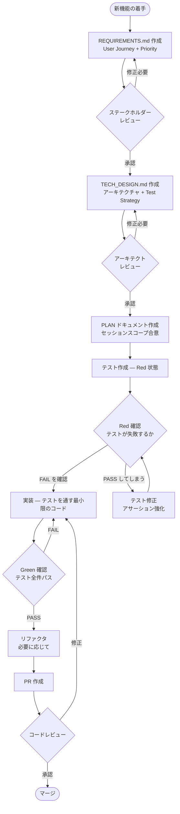
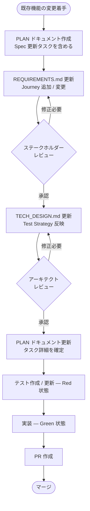
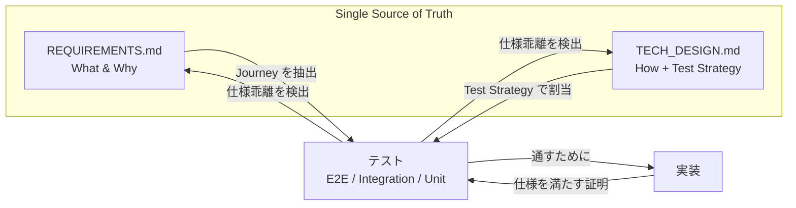
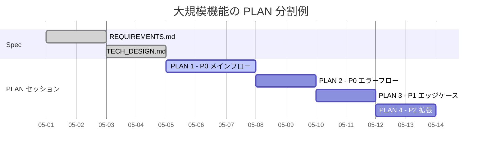

# STDD ワークフロー図

本ドキュメントは `stdd-methodology.md` のフローを Mermaid 図で示す。
Spec → Test → Implementation の流れを視覚的に把握したい場合に参照する。

---

## 1. 新機能開発フロー

---

## 2. 既存機能への追加 / 変更フロー

---

## 3. Spec / Test / Implementation の三角関係

ポイント:

- Spec が SSoT。実装やテストとの乖離が出たら Spec を直す方向で同期する (Spec を後追いしない)
- Test は Spec と Implementation の双方向の "鏡" として機能する
- Implementation は Test を通すための手段にすぎない

---

## 4. PLAN を使ったセッション分割

ポイント:

- 1 つの REQUIREMENTS.md / TECH_DESIGN.md に対して、PLAN は複数発行される
- Priority 順 (P0 → P1 → P2) でセッションを切ると、最重要部分が早期に動く
- 各 PLAN セッション中に Spec の修正が必要になったら、即座に Spec 側を更新する (PLAN だけ独走させない)

---

## 5. Red-Green-Refactor サイクル (1 タスク単位の詳細)

ポイント:

- "PASS してしまう" 場合のフォールバックを明示している (テストが実装の振る舞いを観察できていないバグ)
- リファクタ後も必ずテストを再実行し、Green を維持する

---

## 6. 関連ドキュメント

- `stdd-methodology.md` — STDD の詳細ガイド
- `../templates/` — 各ドキュメントテンプレ
