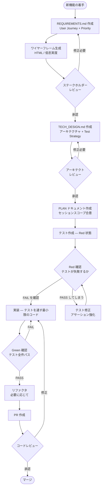
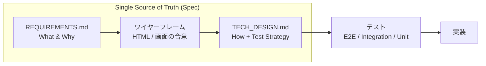
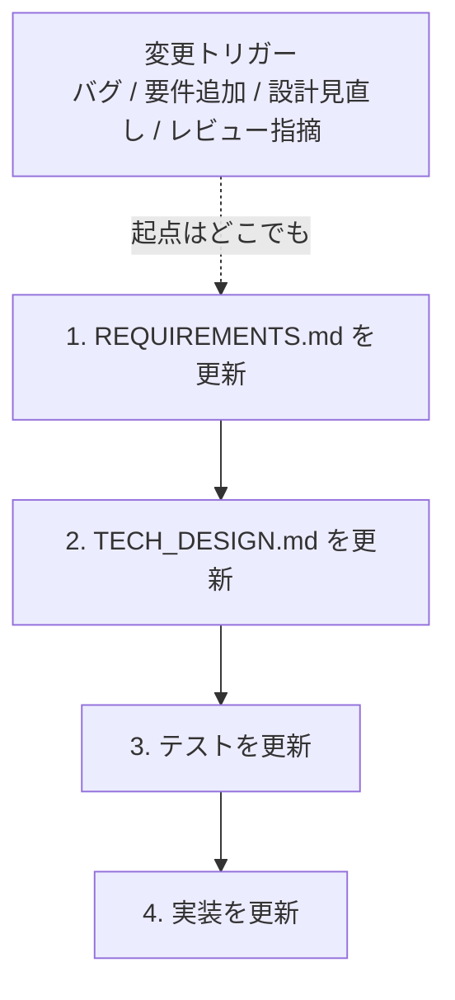
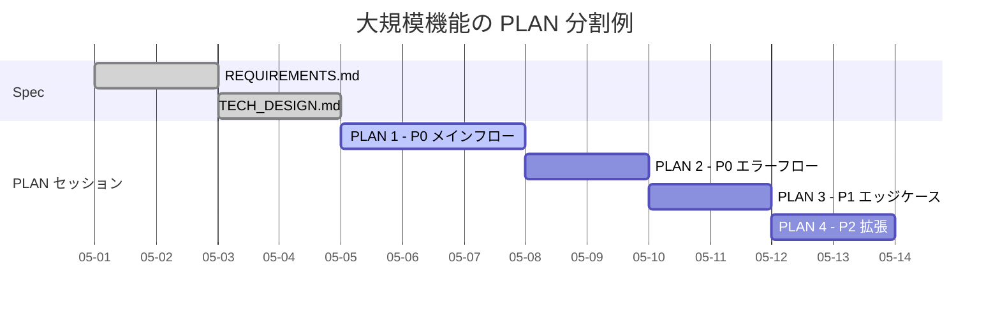
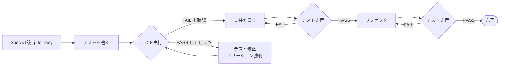

# STDD ワークフロー図

本ドキュメントは `stdd-methodology.md` のフローを Mermaid 図で示す。
Spec → Test → Implementation の流れを視覚的に把握したい場合に参照する。

---

## 1. 新機能開発フロー

---

## 2. 既存機能への追加 / 変更フロー

---

## 3. Spec → Test → Implementation の一方向フロー

STDD は **常に Spec を起点とした一方向のウォーターフォール** で進む。
矢印は決して遡行しない。

### 変更が発生したときも起点は常に Spec

変更の **トリガー** (バグ報告、要件追加、設計見直しなど) は任意の場所で発生してよいが、
**変更の適用** は必ず Spec から開始し、下流に伝播させる。

ポイント:

- Spec が SSoT。実装やテストで発覚した不具合・乖離も、まず Spec を更新し、その後 Test → Impl の順に直す (Spec を後追いさせない)
- 実装側で先に「直したくなる」気持ちが出ても、Spec を飛ばして実装だけ修正すると Spec と実装が乖離し、SSoT 性が壊れる
- これにより Spec が常に最新仕様を保持し、AI エージェントやステークホルダーが Spec だけ読めば最新仕様を把握できる状態を維持する

---

## 4. PLAN を使ったセッション分割

ポイント:

- 1 つの REQUIREMENTS.md / TECH_DESIGN.md に対して、PLAN は複数発行される
- Priority 順 (P0 → P1 → P2) でセッションを切ると、最重要部分が早期に動く
- 各 PLAN セッション中に Spec の修正が必要になったら、即座に Spec 側を更新する (PLAN だけ独走させない)

---

## 5. Red-Green-Refactor サイクル (1 タスク単位の詳細)

ポイント:

- "PASS してしまう" 場合のフォールバックを明示している (テストが実装の振る舞いを観察できていないバグ)
- リファクタ後も必ずテストを再実行し、Green を維持する

---

## 6. 関連ドキュメント

- `stdd-methodology.md` — STDD の詳細ガイド
- `../templates/` — 各ドキュメントテンプレ
