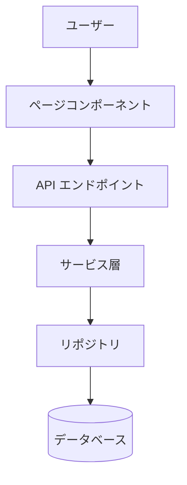
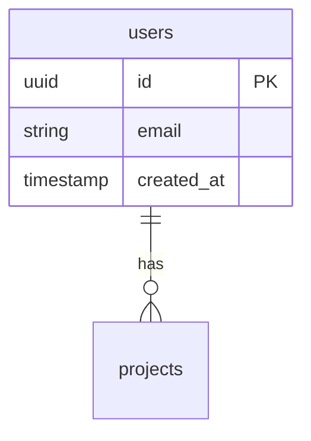

<!--
TECH_DESIGN.md — STDD 技術設計ドキュメント (内部仕様 / 技術視点)

目的:
  - 機能固有のアーキテクチャ、データモデル、API、エラー方針、テスト戦略を定義する
  - 実装者と AI エージェントが「どう作るか (How)」を読み取れる粒度で書く
  - REQUIREMENTS.md の各 User Journey をどのテストレベルでカバーするかを Test Strategy として明示する

配置:
  .stdd.config.yml の `docs.layout.tech_design` に従う。
  デフォルト例: docs/{{app.id}}/{{feature_path}}/TECH_DESIGN.md

含めない:
  - 実装の進捗 ("実装済み" / "新規追加" 等のステータス)。常に最新の設計のみを保持する。
  - 関数 / メソッド / コンポーネントの具体実装コード (型定義 / API 定義 / バリデーションルールは可)
  - チェックボックス形式の TODO リスト (PLAN ドキュメントに記載する)
  - "Integration Points" の単なる外部システム一覧、"Implementation Notes" の実装順序

書き換え方:
  プレースホルダを実値に置き換え、不要セクションは削除する。
  Test Strategy には REQUIREMENTS.md の全 Journey を含め、各 Journey とテストレベルの対応を表で示す。
-->

# [機能名] 技術設計書

---

## 1. 機能固有アーキテクチャ

(この機能固有のアーキテクチャ図とデータフロー)



---

## 2. 主要な設計判断

### 判断 1: [技術選定]

**選択**: ...
**理由**: ...

### 判断 2: [アーキテクチャパターン]

**選択**: ...
**理由**: ...

---

## 3. データモデル

### ER 図



### 型定義

```typescript
export interface UserEntity {
  id: string;
  email: string;
  created_at: string;
}

export interface User {
  id: string;
  email: string;
  createdAt: Date;
}
```

### バリデーションルール

- `email`: 必須、メール形式、最大 255 文字
- `created_at`: ISO8601 形式、過去の日時

---

## 4. API 設計

### エンドポイント

#### POST /api/users

**リクエスト**:

```typescript
interface CreateUserRequest {
  email: string;
}
```

**レスポンス**:

```typescript
interface CreateUserResponse {
  user: User;
}
```

**ビジネスロジック**:

1. メールアドレスの重複チェック
2. ユーザー作成
3. 通知送信

---

## 5. エラーハンドリング戦略

### エラーコード定義

| エラーコード           | HTTP ステータス | メッセージ                                    | 原因                  |
| ---------------------- | --------------- | --------------------------------------------- | --------------------- |
| `USER_NOT_FOUND`       | 404             | ユーザーが見つかりません                      | 存在しないユーザー ID |
| `EMAIL_ALREADY_EXISTS` | 409             | このメールアドレスは既に使用されています      | メール重複            |
| `VALIDATION_ERROR`     | 400             | 入力内容を確認してください                    | バリデーション失敗    |

### 実装方針

- すべてのエラーは `AppError` クラス相当を継承
- エラーコードでエラー種別を識別
- ユーザー向けメッセージとログ用メッセージを分離

---

## 6. セキュリティ要件

- **認証 / 認可**: 実装方法と適用範囲
- **XSS 対策**: 対策内容
- **CSRF 対策**: 対策内容
- **SQL インジェクション対策**: 対策内容
- **個人情報の暗号化**: 暗号化方式

---

## 7. パフォーマンス要件

- **ページ読み込み時間**: N 秒以内
- **API 応答時間**: N ms 以内
- **同時接続数**: N ユーザー

---

## 8. テスト戦略

### ジャーニー別テスト戦略

REQUIREMENTS.md の全 Journey を以下の表に記載し、各テストレベルでの対応を明示する。

| ジャーニー             | E2E       | Integration | Unit | 根拠                                                |
| ---------------------- | --------- | ----------- | ---- | --------------------------------------------------- |
| P0: メインフロー       | ✓        | ✓          | ✓   | Critical path、複数システム統合                     |
| P1: 重要なエラーケース | ⚠️ 検討 | ✓          | ✓   | 頻度高い、Integration 必須、E2E はコストで判断      |
| P2: エッジケース       | ✗        | ⚠️        | ✓   | 低頻度、Unit で十分                                 |

### テストファイル構成

- **E2E**: `e2e/tests/{{app.id}}/{{feature_path}}.spec.ts`
- **Integration**: `{{app.path}}/components/{{name}}.test.tsx`
- **Unit**: `{{app.path}}/lib/*.test.ts`, `{{app.path}}/domain/models/*.test.ts`

各パスは `.stdd.config.yml` の `apps[].path` および `docs.layout` を参照して決定する。
