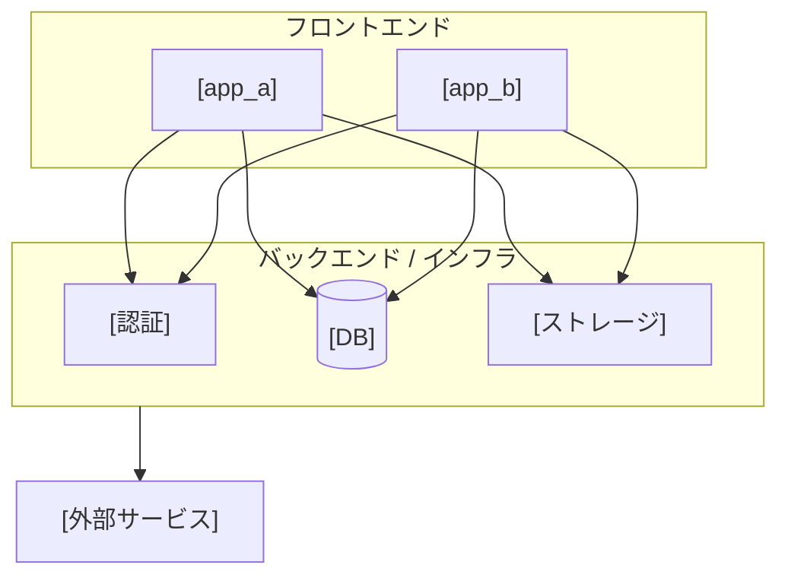
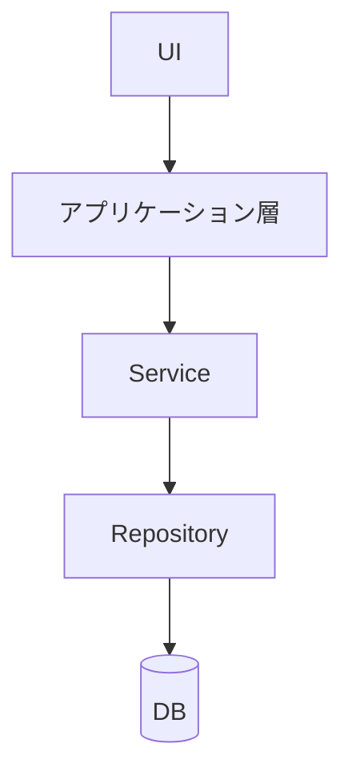
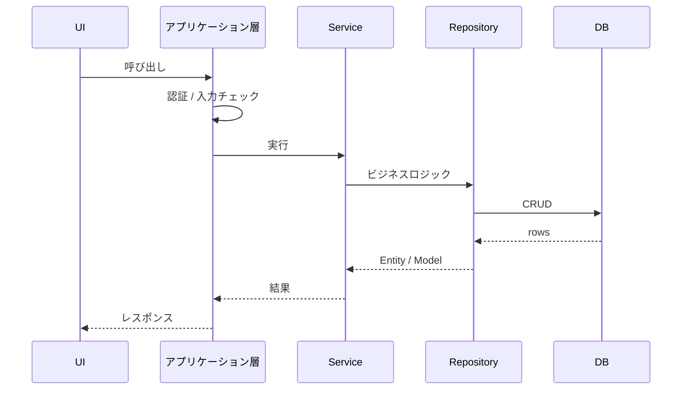
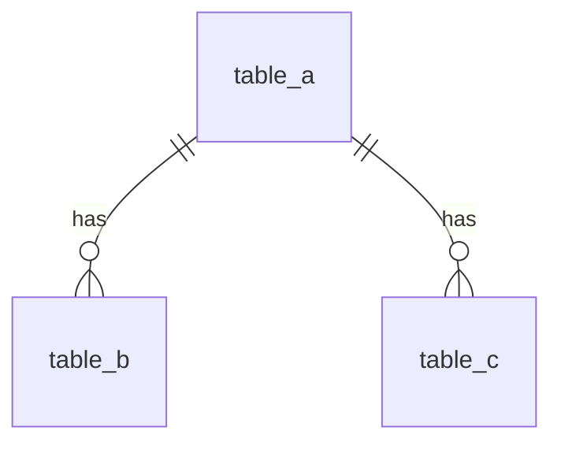

<!--
共通 ARCHITECTURE.md — STDD 技術設計ドキュメント (プロジェクト全体 / 技術視点)

位置づけ:
  - 本ファイルは STDD の TECH_DESIGN.md の「全体版」。プロジェクト全体の技術設計を
    俯瞰する正典 (SSoT) であり、feature 単位の TECH_DESIGN.md の上位ティアにあたる。
  - feature ティアと名前を分けるため、全体版は ARCHITECTURE.md と呼ぶ
    (システム全体 = ARCHITECTURE / 機能単位 = TECH_DESIGN)。
  - サービスの目的・アクター・アプリの責務分担は ./REQUIREMENTS.md を参照する。
  - 機能・ページ単位の技術設計は docs/<app>/<feature>/TECH_DESIGN.md を参照する。

目的:
  - システム構成・リポジトリ構成・レイヤ規約・データモデルなど、複数 feature が前提とする
    横断的な技術文脈を一箇所に固定する
  - 各 feature の TECH_DESIGN.md が「全体のどこに位置するか」を判断する基準を提供する

配置:
  .stdd.config.yml の docs.layout.common_architecture に従う。
  デフォルト例: docs/common/ARCHITECTURE.md

含めない:
  - 機能単位のアーキテクチャ・API・テスト戦略 (→ 各 feature の TECH_DESIGN.md)
  - 実装の進捗・履歴・変更経緯・リネーム履歴 (SSoT として常に最新の構成のみ保持する)
  - 関数 / メソッドの具体実装コード (型定義 / I/F / スキーマ定義は可)

要確認マーカーについて:
  リバースエンジニアリングで作成した直後など、実装からの読み取りに確信が持てない箇所は
  `<!-- 要確認: ... -->` のインラインコメントで明示してよい。これは一時的な注記であり、
  人間レビューで確定したら必ず除去する (恒久的に残さない)。

書き換え方:
  プレースホルダを実値に置換し、不要セクション・不要な図は削除する。
  単一アプリ構成の場合は複数アプリ前提の記述 (workspaces / 共有パッケージ / 依存逆転 等) を畳む。
-->

# [サービス名] アーキテクチャ設計書

> **位置づけ**: 本ドキュメントは [サービス名] 全体の技術設計を俯瞰する正典である。STDD における `TECH_DESIGN.md` の全体版にあたる。
> サービスの目的・アクターなどのビジネス要件は [`REQUIREMENTS.md`](./REQUIREMENTS.md) を参照。
> 機能・ページ単位の技術設計は `docs/<app>/<feature>/TECH_DESIGN.md` を参照。
>
> **最終更新**: [yyyy-mm-dd] / **基準ブランチ**: [main / develop 等]

---

## 目次

1. [システム構成](#1-システム構成)
2. [リポジトリ構成](#2-リポジトリ構成)
3. [レイヤードアーキテクチャ](#3-レイヤードアーキテクチャ)
4. [データモデル・DB設計](#4-データモデルdb設計)
5. [付録・関連ドキュメント](#付録関連ドキュメント)

---

## 1. システム構成

### 1.1 コンテキスト図

(フロントエンド / バックエンド / 外部サービスの関係を 1 枚で示す)



### 1.2 構成要素一覧

| コンポーネント | 種別     | 役割                          |
| -------------- | -------- | ----------------------------- |
| [app_a]        | アプリ   | (対象ユーザーと責務)          |
| [app_b]        | アプリ   | (対象ユーザーと責務)          |
| [DB]           | DB       | (永続化層・アクセス制御方針)  |
| [認証]         | 認証     | (認証方式・プロバイダ)        |
| [ホスティング] | インフラ | (デプロイ先)                  |

### 1.3 外部サービス連携

- **[サービス名]**: (用途・呼び出し元)
- **[サービス名]**: (用途・呼び出し元)

### 1.4 デプロイ・環境

| 環境  | 用途 | フロントエンド | バックエンド / DB     |
| ----- | ---- | -------------- | --------------------- |
| local | 開発 | ...            | ...                   |
| STG   | 検証 | ...            | ([ブランチ] で自動)   |
| PROD  | 本番 | ...            | ([ブランチ] で自動)   |

- **ブランチ戦略**: メインは `[main / develop]`、作業ブランチは `[命名規則]` とする。

---

## 2. リポジトリ構成

### 2.1 トップレベル構成

```
[repo]/
├── [app_a]/           # (役割)
├── [app_b]/           # (役割)
├── packages/          # (共有パッケージ。単一アプリなら不要)
├── docs/              # 機能別 Spec + 全体ドキュメント (本書を含む)
├── scripts/           # (補助スクリプト)
└── .github/workflows/ # CI/CD
```

### 2.2 パッケージ / モジュール分割

(monorepo の場合は workspace 一覧、単一アプリの場合は主要モジュールの責務を記す)

| 単位       | 役割                                |
| ---------- | ----------------------------------- |
| [app_a]    | (アプリ本体)                        |
| [shared]   | (複数アプリ共有ロジック。任意)      |

### 2.3 依存管理ルール

(依存をどこに置くか・アプリ間 import の禁止有無などの横断ルール)

---

## 3. レイヤードアーキテクチャ

### 3.1 レイヤー構成

各アプリ / 共有モジュールのレイヤー責務:

| ディレクトリ  | 責務                                  | DI                          |
| ------------- | ------------------------------------- | --------------------------- |
| `models/`     | Entity / ドメインモデル               | —                           |
| `repository/` | データアクセス (CRUD)                 | constructor で受け取る      |
| `service/`    | ビジネスロジック                      | constructor で受け取る      |

### 3.2 依存方向ルール

依存は一方向。下位レイヤーは上位を知らない。



**禁止される依存方向**

- Repository → Service: 逆向きのため禁止。Service が Repository の interface に依存する。
- (プロジェクト固有の禁止ルールを追記)

### 3.3 データフロー

(代表的なリクエストの流れを 1 本、シーケンス図で示す)



---

## 4. データモデル・DB設計

### 4.1 設計方針

- **削除方針**: (論理削除 / 物理削除のいずれか、判定カラム)
- **主キー**: (UUID / 連番 等)
- **時系列**: (`created_at` / `updated_at` などの方針)
- **マイグレーション**: (命名規則・冪等性方針)

### 4.2 ドメイン分類とテーブル一覧

(テーブルをドメイングループに整理する。生成された型定義ファイルを正とする)

| #   | グループ     | テーブル                        |
| --- | ------------ | ------------------------------- |
| ①   | [グループ名] | `table_a`, `table_b`            |
| ②   | [グループ名] | `table_c`, `table_d`            |

### 4.3 ER 図

(中心テーブルごとに分割して示す。1 枚に詰め込まない)



> 上記はカーディナリティの概観であり、実際の外部キー・NULL 許容はマイグレーション / 型定義を正とする。

---

## 付録・関連ドキュメント

- 共通要件定義: [`./REQUIREMENTS.md`](./REQUIREMENTS.md)
- STDD 方法論: `packages/core/docs/stdd-methodology.md`
- 機能別 Spec: `docs/<app>/<feature>/REQUIREMENTS.md`, `TECH_DESIGN.md`
