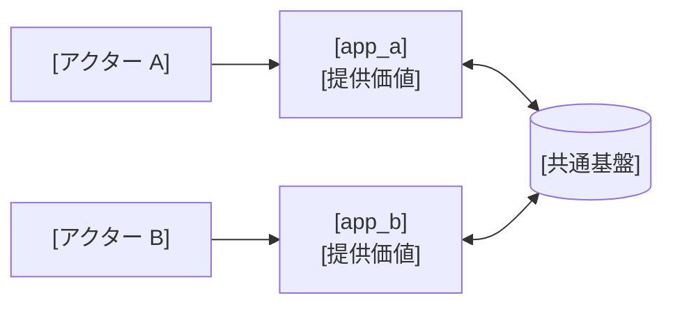

<!--
共通 REQUIREMENTS.md — STDD 仕様ドキュメント (プロジェクト全体 / ビジネス要件)

位置づけ:
  - 本ファイルは STDD の REQUIREMENTS.md の「全体版」。プロジェクト全体のビジネス要件を
    俯瞰する正典 (SSoT) であり、feature 単位の REQUIREMENTS.md の上位ティアにあたる。
  - 機能・ページ単位の要件は docs/<app>/<feature>/REQUIREMENTS.md を参照する (feature ティア)。
  - プロジェクト全体の技術設計は ./ARCHITECTURE.md を参照する。

目的:
  - サービスの目的・対象ユーザー・アプリ構成を、全ステークホルダーが俯瞰できる粒度で固定する
  - 各 feature spec が前提とする共通文脈 (誰が・何のために・どのアプリで) を一箇所に集約する

配置:
  .stdd.config.yml の docs.layout.common_requirements に従う。
  デフォルト例: docs/common/REQUIREMENTS.md

含めない:
  - 機能単位のユーザージャーニー詳細 (→ 各 feature の REQUIREMENTS.md)
  - システム構成・データモデル等の技術設計 (→ ./ARCHITECTURE.md)
  - 実装の進捗・履歴・変更経緯 (SSoT として常に最新の要件のみ保持する)

書き換え方:
  プレースホルダ ([サービス名], [アクター名], [app_a] 等) を実値に置換し、不要セクションは削除する。
  単一アプリ構成の場合は「3. アプリ構成と提供価値」の複数アプリ記述を 1 アプリ分に畳む。
-->

# [サービス名] 共通要件定義

> **位置づけ**: 本ドキュメントは [サービス名] 全体のビジネス要件を俯瞰する正典である。STDD における `REQUIREMENTS.md` の全体版にあたる。
> システム構成やデータモデルなどの技術設計は [`ARCHITECTURE.md`](./ARCHITECTURE.md) を参照。
> 機能・ページ単位の要件は `docs/<app>/<feature>/REQUIREMENTS.md` を参照。
>
> **最終更新**: [yyyy-mm-dd] / **基準ブランチ**: [main / develop 等]

---

## 目次

1. [サービス概要・目的](#1-サービス概要目的)
2. [登場アクター](#2-登場アクター)
3. [アプリ構成と提供価値](#3-アプリ構成と提供価値)
4. [関連ドキュメント](#関連ドキュメント)

---

## 1. サービス概要・目的

([サービス名] が解決する課題と提供価値を 2 〜 4 文で記述する)

- **[主アクター A]** は、... する。
- **[主アクター B]** は、... する。

---

## 2. 登場アクター

| アクター     | 利用アプリ | 概要                       |
| ------------ | ---------- | -------------------------- |
| [アクター A] | [app_a]    | (役割・属性を 1 文で)      |
| [アクター B] | [app_b]    | (役割・属性を 1 文で)      |

---

## 3. アプリ構成と提供価値

(各アクターがどのアプリを使い、どの共通基盤を介してつながるかを示す。単一アプリなら 1 アプリ分に畳む)

- **[app_a]**: ([対象ユーザー] 向け。主な提供価値)
- **[app_b]**: ([対象ユーザー] 向け。主な提供価値)

> アプリ間の技術的境界・共有方針は [`ARCHITECTURE.md`](./ARCHITECTURE.md) を参照。

---

## 関連ドキュメント

- 全体の技術設計: [`./ARCHITECTURE.md`](./ARCHITECTURE.md)
- 機能別 Spec: `docs/<app>/<feature>/REQUIREMENTS.md`, `TECH_DESIGN.md`
- STDD 方法論: `packages/core/docs/stdd-methodology.md`
