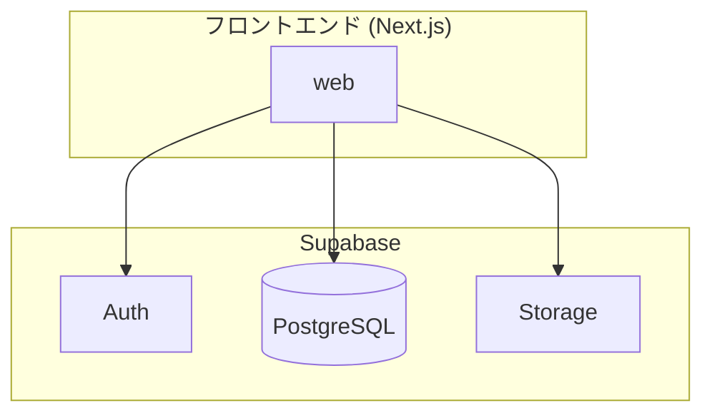

<!--
共通 ARCHITECTURE.md — STDD システム概要ドキュメント (プロジェクト全体 / 技術視点)

位置づけ:
  - 本ファイルは common ティアの技術設計（システム概要）。複数 feature が前提とする横断的な
    技術文脈（構成・スタック・連携・セキュリティ・インフラ）を俯瞰する正典 (SSoT)。
  - データモデルは ./TABLE_DEFINITION.md、API 仕様は ./API_SPEC.md に分離する（本書には持たない）。
  - サービスの目的・アクター・アプリの責務分担は ./REQUIREMENTS.md を参照する。
  - 機能・ページ単位の技術設計は docs/<app>/<feature>/TECH_DESIGN.md を参照する。

書き換え方:
  プレースホルダを実値に置換し、不要な節・図は削除する。
  単一アプリ構成では複数アプリ前提の記述（workspaces / 共有パッケージ 等）を畳む。
-->

# [サービス名] アーキテクチャ設計書

> **位置づけ**: 本書は [サービス名] 全体のシステム概要を俯瞰する正典（common ティアの技術設計）。
> サービスの目的・アクターなどのビジネス要件は [`REQUIREMENTS.md`](./REQUIREMENTS.md) を参照。
> データモデルは [`TABLE_DEFINITION.md`](./TABLE_DEFINITION.md)、API 仕様は [`API_SPEC.md`](./API_SPEC.md) を参照。
> 機能・画面単位の技術設計は `docs/<app>/<feature>/TECH_DESIGN.md` を参照。
>
> **最終更新**: [yyyy-mm-dd] / **基準ブランチ**: [main / develop 等]

---

## 1. システム概要

### 1.1 システム構成概要

（本システムが何であるか・全体構成・特徴を端的に。1 枚の構成図を添える）

**全体構成**

- フロントエンド層: Next.js（App Router）。CSR / SSR の方針を明記
- バックエンド層: Supabase（PostgreSQL / Auth / Storage）を利用
- データソース: Supabase Database（主要テーブル群）



**特徴**

- [参照専用 / 書き込みあり 等の基本性質]
- [RLS によるアクセス制御方針]

**リポジトリ構成 / レイヤ規約**

```
[repo]/
├── app/               # Next.js App Router
├── components/        # UI コンポーネント
├── lib/               # ドメイン / データアクセス
├── docs/              # 機能別 Spec + 全体ドキュメント (本書を含む)
└── .github/workflows/ # CI/CD
```

| レイヤー | 責務 | 依存方向 |
| --- | --- | --- |
| app / components | 表示・入力・認証ガード | 下位へのみ依存 |
| lib（service） | ビジネスロジック | repository の I/F に依存 |
| lib（repository） | データアクセス（Supabase client） | DB |

（依存は一方向。下位レイヤーは上位を知らない）

### 1.2 使用技術スタック

**フロントエンド**

- Next.js / React / TypeScript

**バックエンド / データ基盤**

- Supabase（PostgreSQL / Auth / Storage）。データアクセスは Supabase クライアント経由

**テスト**

- E2E: Playwright ／ Unit / Integration: [採用ツール]

**CI/CD・ホスティング**

- [ビルド・デプロイ自動化 / ホスティング先（例: Vercel）]

### 1.3 システム間連携

**主要連携**

1. web ⇔ Supabase Auth: ログイン認証・セッション管理
2. web ⇔ Supabase Database: 各種テーブルの参照 / 更新（RLS 適用）

**連携方針**

- [専用バックエンドを設けるか / フロントから Supabase 直接連携か]

**外部連携**

- [外部システム連携。なければ「現時点で未定義」]

### 1.4 データフロー概要

**[認証フロー]**

1. ユーザーが認証情報を入力 → Supabase Auth へ認証要求
2. 成功 → セッショントークンを保持しアプリへ遷移 / 失敗 → エラー表示
3. 認証ガードが各遷移でトークンを検証し、未認証はログインへリダイレクト

**[データ参照 / 更新フロー]**

1. 認証済みユーザーの操作で Supabase へクエリ発行（`deleted_at IS NULL` 等で絞り込み）
2. 結果をクライアントで加工・表示

### 1.5 セキュリティ概要

- **認証・アクセス制御**: Supabase Auth + 認証ガード。未認証アクセスを遮断
- **セッション / トークン管理**: トークンの保持・検証・失効時の再ログイン
- **通信**: TLS（HTTPS）
- **データ保護**: Row Level Security（RLS）。機密鍵をフロントに含めない（anon key のみ）

### 1.6 インフラ構成概要

- **ホスティング**: [フロントの配置先]
- **データ・認証基盤**: Supabase（Database / Auth / Storage）
- **可用性**: [稼働率目標・メンテナンス方針]
- **CI/CD・運用・監視**: [自動化・監視・通知]
- **性能・拡張性**: [同時接続・対象ブラウザ・最適化方針]

---

## 付録・関連ドキュメント

- 共通要件定義: [`./REQUIREMENTS.md`](./REQUIREMENTS.md)
- テーブル定義: [`./TABLE_DEFINITION.md`](./TABLE_DEFINITION.md)
- API 仕様: [`./API_SPEC.md`](./API_SPEC.md)
- 機能別 Spec: `docs/<app>/<feature>/TECH_DESIGN.md`
